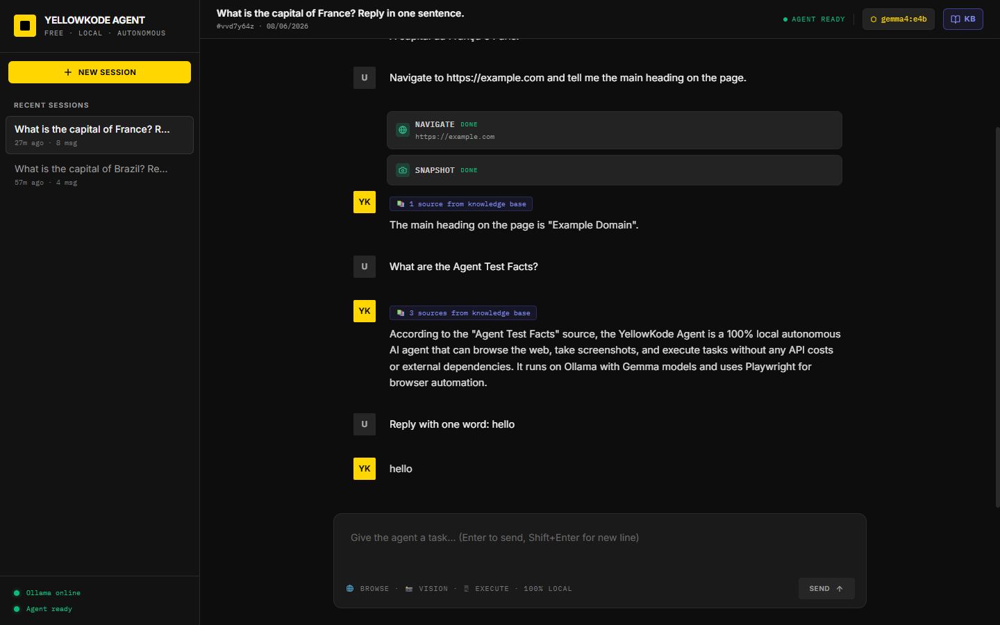
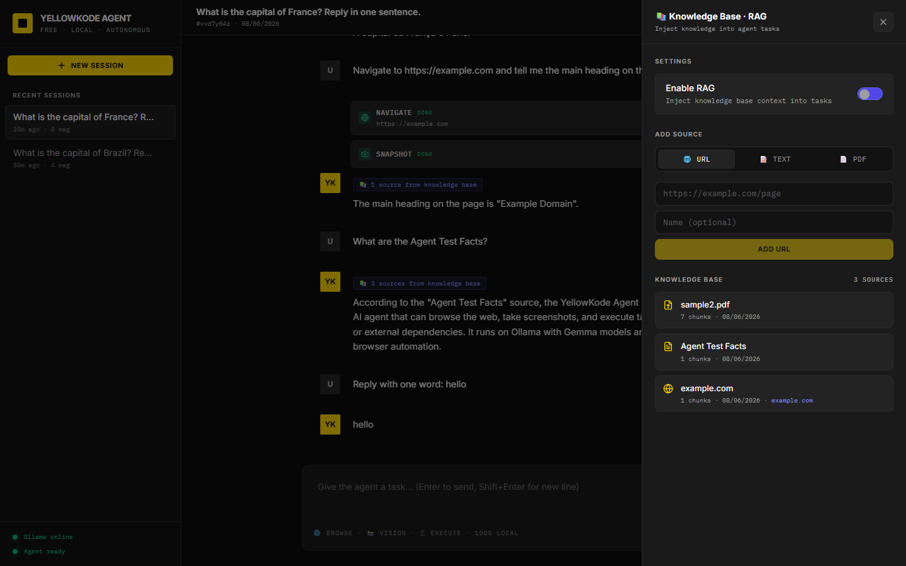

# YellowKode Agent

Agente de IA autônomo e local, navega na web, extrai dados e executa tarefas sem nenhuma API key.


> 🇺🇸 [English version](README.md)

## Screenshots

| Agente navegando na web | Base de Conhecimento (RAG) |
|---|---|
|  |  |

---

## O que é

Agente de IA autônomo rodando **100% no seu computador**. Sem nenhuma conta, token ou chave de API.

Combina um LLM local (Gemma 4 via Ollama) com um navegador real (Playwright) para executar tarefas na web: scraping, pesquisa em tempo real, extração de dados.

## Como funciona

```
Você envia uma tarefa
        ↓
Gemma 4 decide qual ferramenta usar
        ↓
Playwright abre o navegador e carrega a página
        ↓
O resultado volta para o Gemma 4
        ↓
Resposta em streaming com cards mostrando cada passo
```

## Como usar

**Pré-requisito:** [Docker Desktop](https://www.docker.com/products/docker-desktop/)

```bash
git clone <url> yk-agent
cd yk-agent
cp .env.example .env
docker compose up -d
```

Acesse em **http://localhost:3001**

> Na primeira execução, o modelo é baixado automaticamente (~2.5 GB para `gemma4:e4b`).
> Acompanhe com `docker compose logs -f model-init`.

## Exemplos de tarefas

```
Acesse https://example.com e me diz o que está na página.
```
```
Acesse https://news.ycombinator.com e me traga os títulos das primeiras histórias.
```
```
Acesse https://github.com/ollama/ollama e me dê um resumo do projeto.
```

## Funcionalidades

- Navegação autônoma com cards mostrando cada ação em tempo real (Navigate, Snapshot)
- Múltiplas sessões com histórico salvo localmente
- **Base de Conhecimento (RAG)**: adicione URLs, textos ou PDFs; o agente usa esse conteúdo com badge indicando quantas fontes foram usadas

## Modelos

| Modelo | RAM | Indicado para |
|---|---|---|
| `gemma4:e2b` | ~1 GB | Máquinas com pouca RAM |
| `gemma4:e4b` | ~2.5 GB | **Recomendado** |
| `gemma4:12b` | ~7 GB | Tarefas mais complexas |
| `llama3.2` | ~2 GB | Alternativa leve |

Edite `GEMMA_MODEL` no `.env` para trocar de modelo. Qualquer modelo com suporte a tool calling funciona.

## Comandos

```bash
docker compose logs -f          # logs em tempo real
docker compose ps               # status dos serviços
docker compose down             # parar
docker compose down -v          # parar e apagar dados
```

## Troubleshooting

```bash
docker compose logs yk_agent_api    # agente não responde
docker compose logs yk_playwright   # navegador não conecta
docker compose logs yk_model_init   # modelo não baixou
```

---

MIT License, [YellowKode](https://yellowkode.com) + [Wunka Tech](https://wunka.tech)
